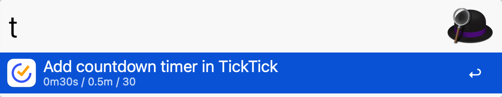

## Alfred Workflow for TickTick

A personal workflow for TickTick, currently only supports countdown.

### Usage

1. Install workflow and configure credentials
2. Execute `dump ticktick` in Alfred
3. Paste the result into `${workflow_folder}/.env`
4. In `${workflow_folder}`, execute `python main.py` to make initial auth
5. You are good to go, try executing `t 1m30s` in alfred

### Dev

In addition to steps in [Usage](#usage)

1. `pip install --target=. -r requirements.txt --upgrade`
2. Make your modifications
3. Copy `src/*` to `${workflow_folder}` to test it out
4. Export `.alfredworkflow` and make PR

### Acknowledgements

[lazeroffmichael/ticktick-py: Unofficial TickTick API](https://github.com/lazeroffmichael/ticktick-py)

